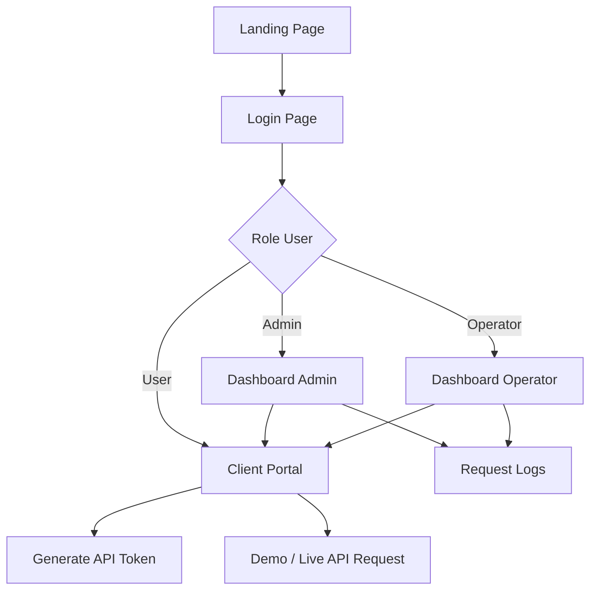
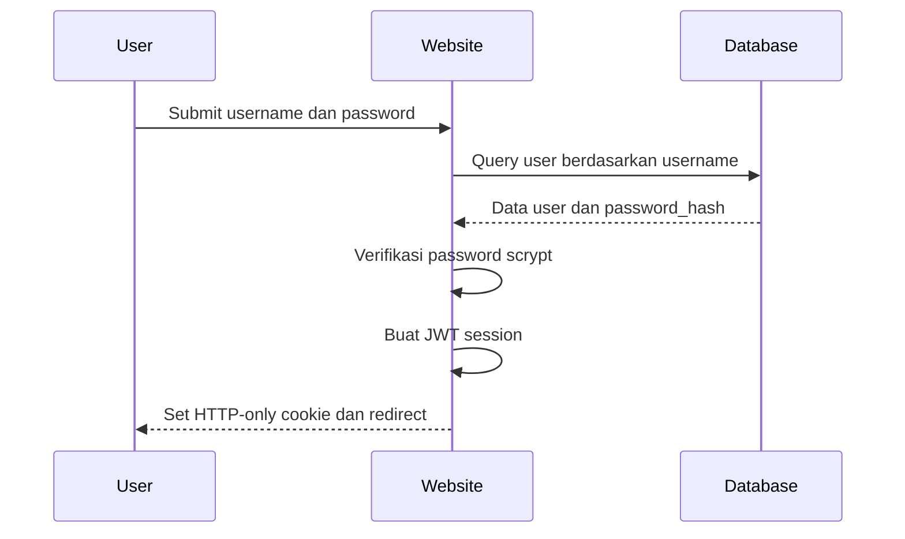
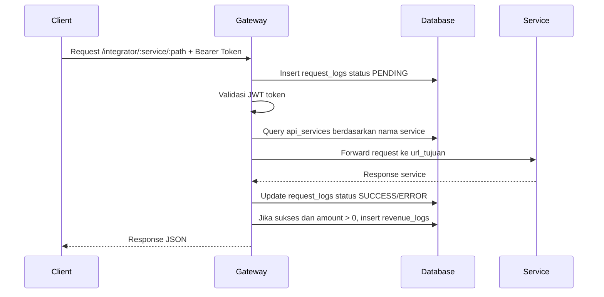

# Dokumentasi Website Gateway Integrator

## 1. Ringkasan Aplikasi

Gateway Integrator adalah website dashboard dan API gateway berbasis Node.js, Express, EJS, dan MySQL. Website ini berfungsi sebagai pusat akses untuk memantau request API, mengelola autentikasi pengguna, melihat statistik layanan, menjalankan simulasi request, serta mencatat pendapatan gateway dari transaksi yang berhasil.

Aplikasi ini dirancang sebagai middleware antara client dan beberapa service dalam ekosistem UMKM, seperti SmartBank, Marketplace, POS, SupplierHub, LogistiKita, dan UMKM Insight.

## 2. Tujuan Website

Website ini dibuat untuk:

- Menyediakan halaman login dengan pembagian role pengguna.
- Menampilkan dashboard statistik API untuk admin dan operator.
- Menyediakan client portal untuk generate token dan simulasi request API.
- Memisahkan log traffic request dari pencatatan pendapatan.
- Menggunakan tabel database `api_services` sebagai sumber routing service.
- Memberikan tampilan UI yang modern, rapi, dan mudah digunakan.

## 3. Teknologi yang Digunakan

| Komponen | Teknologi |
|---|---|
| Backend | Node.js, Express.js |
| View Engine | EJS |
| Database | MySQL |
| Database Driver | mysql2 |
| HTTP Client | Axios |
| Authentication | JWT + HTTP-only cookie |
| API Token | JWT Bearer Token |
| UI Chart | Chart.js |
| UI Icon | Lucide Icons |
| Styling | CSS custom theme |

## 4. Role Pengguna

Website memiliki tiga role utama:

| Role | Hak Akses |
|---|---|
| Admin | Login, melihat dashboard penuh, melihat grafik request, melihat grafik pendapatan, melihat request logs, menggunakan client portal |
| Operator | Login, melihat dashboard request, melihat request logs, menggunakan client portal, tidak melihat data pendapatan |
| User | Login dan menggunakan client portal untuk generate token dan simulasi request |

Pembatasan role dilakukan melalui middleware `requireAuth` dan `requireRole`.

## 5. Struktur Halaman Website

### 5.1 Landing Page

URL:

```text
GET /
```

Landing page adalah halaman pembuka aplikasi. Halaman ini menampilkan identitas aplikasi, deskripsi singkat Gateway Integrator, dan tombol menuju login dashboard atau status API.

Fitur utama:

- Menampilkan nama aplikasi Gateway Integrator.
- Menjelaskan fungsi utama gateway.
- Menampilkan highlight fitur seperti validasi JWT, dynamic routing, revenue ledger, dan dashboard statistik.
- Menyediakan tombol masuk ke halaman login.

### 5.2 Login Page

URL:

```text
GET /login
POST /login
```

Halaman login digunakan untuk autentikasi pengguna website. Setelah login berhasil, pengguna akan diarahkan sesuai role.

Alur login:

1. Pengguna mengisi username dan password.
2. Server mencari user di tabel `users`.
3. Password diverifikasi menggunakan hash scrypt.
4. Jika valid, server membuat session token JWT.
5. Token disimpan dalam HTTP-only cookie.
6. Pengguna diarahkan ke dashboard atau client portal.

Akun awal:

| Username | Password | Role |
|---|---|---|
| admin | admin123 | admin |
| operator | operator123 | operator |
| user | user123 | user |

### 5.3 Dashboard

URL:

```text
GET /dashboard
```

Dashboard hanya dapat diakses oleh role `admin` dan `operator`.

Fitur dashboard:

- Menampilkan total request.
- Menampilkan jumlah request sukses.
- Menampilkan jumlah request error.
- Menampilkan grafik request API per layanan.
- Menampilkan tabel recent traffic logs.
- Menampilkan daftar service API dari tabel `api_services`.
- Menampilkan daftar dynamic routes.

Perbedaan dashboard berdasarkan role:

| Fitur | Admin | Operator |
|---|---|---|
| Total request | Ya | Ya |
| Request sukses | Ya | Ya |
| Request error | Ya | Ya |
| Grafik request per layanan | Ya | Ya |
| Grafik pendapatan | Ya | Tidak |
| Total pendapatan gateway | Ya | Tidak |
| Request logs | Ya | Ya |

### 5.4 Client Portal

URL:

```text
GET /client-portal
```

Client Portal dapat diakses oleh admin, operator, dan user. Halaman ini digunakan untuk membuat token API dan melakukan simulasi request.

Fitur utama:

- Generate JWT Bearer token.
- Quick test endpoint internal gateway.
- Simulasi API ke enam service.
- Preview fee gateway secara real-time.
- Mode demo simulasi sukses.
- Mode live request ke service asli.
- Panduan integrasi API.

### 5.5 System Status

URL:

```text
GET /api/status
```

Endpoint ini digunakan untuk melihat status aplikasi gateway. Response berisi status server, uptime, jumlah request, total revenue, dan daftar service dari database.

## 6. Alur Navigasi Website



## 7. Alur Autentikasi Website



## 8. Alur API Gateway



## 9. Desain Database

### 9.1 Tabel users

Tabel `users` menyimpan akun website.

| Kolom | Tipe | Keterangan |
|---|---|---|
| id | INT | Primary key |
| username | VARCHAR(100) | Username unik |
| password_hash | VARCHAR(255) | Hash password menggunakan scrypt |
| role | ENUM | admin, operator, user |
| created_at | DATETIME | Waktu pembuatan akun |

### 9.2 Tabel api_services

Tabel `api_services` menyimpan daftar service tujuan gateway.

| Kolom | Tipe | Keterangan |
|---|---|---|
| id | INT | Primary key |
| nama_service | VARCHAR(100) | Nama service, misalnya smartbank |
| url_tujuan | VARCHAR(500) | Base URL service tujuan |
| status_aktif | TINYINT | 1 aktif, 0 nonaktif |
| created_at | DATETIME | Waktu data dibuat |
| updated_at | DATETIME | Waktu data diperbarui |

### 9.3 Tabel request_logs

Tabel `request_logs` hanya menyimpan metadata request API.

| Kolom | Tipe | Keterangan |
|---|---|---|
| id | INT | Primary key |
| waktu | VARCHAR(100) | Waktu request format lokal |
| timestamp | DATETIME | Timestamp request |
| ip | VARCHAR(50) | IP client |
| metode | VARCHAR(10) | HTTP method |
| url_tujuan | VARCHAR(500) | URL request gateway |
| user_id | VARCHAR(100) | User dari token |
| service_tujuan | VARCHAR(100) | Nama service tujuan |
| status | VARCHAR(20) | PENDING, FORWARDED, SUCCESS, ERROR |
| response_status | INT | HTTP status response |
| mode | VARCHAR(20) | DEMO atau NULL |

### 9.4 Tabel revenue_logs

Tabel `revenue_logs` menyimpan pencatatan fee atau pendapatan gateway.

| Kolom | Tipe | Keterangan |
|---|---|---|
| id | INT | Primary key |
| request_id | INT | Relasi ke request_logs |
| nominal_fee | DECIMAL(12,2) | Nominal fee gateway |
| waktu | DATETIME | Waktu pencatatan pendapatan |

## 10. Pemisahan Request Log dan Revenue Log

Sebelum upgrade, fee disimpan langsung di tabel `request_logs`. Setelah upgrade, pencatatan dipisahkan:

- `request_logs` fokus pada metadata traffic API.
- `revenue_logs` fokus pada pencatatan uang atau fee.

Keuntungan desain ini:

- Struktur database lebih rapi.
- Statistik traffic dan statistik pendapatan tidak tercampur.
- Revenue dapat diaudit secara terpisah.
- Query dashboard lebih jelas.
- Cocok untuk pengembangan fitur laporan keuangan.

## 11. Dynamic Service Routing

Gateway tidak lagi mengambil routing service dari konfigurasi hardcode. Service tujuan dibaca dari tabel `api_services`.

Contoh data service:

| nama_service | url_tujuan | status_aktif |
|---|---|---|
| smartbank | http://localhost:3001 | 1 |
| marketplace | http://localhost:3002 | 1 |
| pos | http://localhost:3003 | 1 |
| supplierhub | http://localhost:3004 | 1 |
| logistikita | http://localhost:3005 | 1 |
| umkm_insight | http://localhost:3006 | 1 |

Contoh route:

```text
/integrator/smartbank/pembayaran_transaksi
```

Gateway akan:

1. Membaca `smartbank` dari parameter URL.
2. Query `api_services` untuk mendapatkan `url_tujuan`.
3. Forward request ke service tujuan.
4. Mencatat hasil request ke `request_logs`.

## 12. Statistik dan Grafik Dashboard

Dashboard menggunakan Chart.js untuk menampilkan data statistik.

Grafik yang tersedia:

| Grafik | Role | Sumber Data |
|---|---|---|
| Request API per layanan | Admin, Operator | request_logs |
| Pendapatan gateway | Admin | revenue_logs |

Operator tidak melihat grafik pendapatan karena data keuangan hanya ditampilkan untuk admin.

## 13. Endpoint Website dan API

### 13.1 Endpoint Website

| Method | Endpoint | Akses |
|---|---|---|
| GET | / | Publik |
| GET | /login | Publik |
| POST | /login | Publik |
| POST | /logout | Login |
| GET | /dashboard | Admin, Operator |
| GET | /client-portal | Admin, Operator, User |

### 13.2 Endpoint API Internal

| Method | Endpoint | Akses |
|---|---|---|
| GET | /api/status | Publik |
| GET | /api/logs | Admin, Operator |
| GET | /api/services | Admin, Operator |
| POST | /api/demo/simulate | Admin, Operator, User |
| POST | /generate-test-token | Admin, Operator, User |

### 13.3 Endpoint API Gateway

| Method | Endpoint | Akses |
|---|---|---|
| GET | /integrator/routing_api | JWT Bearer |
| GET | /integrator/validasi_request | JWT Bearer |
| GET | /integrator/logging | JWT Bearer |
| GET | /integrator/biaya_layanan_integrasi | JWT Bearer |
| ALL | /integrator/:service/{path} | JWT Bearer |
| ALL | /integrator/:service | JWT Bearer |

## 14. Contoh Penggunaan Client Portal

### Generate Token

1. Login ke website.
2. Buka halaman Client Portal.
3. Isi User ID dan Nama.
4. Klik tombol Generate.
5. Token akan muncul di input token dan bisa disalin.

### Demo Simulasi

1. Pilih service tujuan.
2. Isi amount transaksi.
3. Klik Demo Simulasi Sukses.
4. Website akan menampilkan response JSON simulasi.
5. Request tercatat ke `request_logs`.
6. Jika amount lebih dari 0, fee tercatat ke `revenue_logs`.

### Live Request

1. Pilih endpoint service tujuan.
2. Pastikan service downstream berjalan.
3. Isi token dan amount.
4. Klik Live Request.
5. Gateway akan meneruskan request ke service asli.

## 15. Keamanan

Fitur keamanan yang diterapkan:

- Login menggunakan password hash scrypt.
- Session disimpan dalam HTTP-only cookie.
- Proteksi halaman menggunakan `requireAuth`.
- Pembatasan role menggunakan `requireRole`.
- Endpoint gateway memerlukan JWT Bearer token.
- Token API memiliki masa berlaku.

## 16. Struktur File Website

```text
RPL_Integrator-main/
├── server.js
├── config/
│   ├── database.js
│   └── init.sql
├── middleware/
│   ├── auth.js
│   └── logger.js
├── routes/
│   └── gateway.js
├── views/
│   ├── index.ejs
│   ├── login.ejs
│   ├── dashboard.ejs
│   └── client_portal.ejs
├── public/
│   └── css/
│       └── kong-theme.css
└── Docs/
    └── Dokumentasi_Website_Gateway_Integrator.md
```

## 17. Cara Menjalankan Website

### 17.1 Install Dependency

```bash
npm install
```

### 17.2 Pastikan MySQL Berjalan

Pastikan MySQL di Laragon sudah aktif dan database `rpl_integrator` tersedia. Aplikasi akan membuat tabel yang diperlukan saat server dijalankan.

### 17.3 Jalankan Server

```bash
node server.js
```

### 17.4 Akses Website

```text
Landing Page  : http://localhost:3000
Login Page    : http://localhost:3000/login
Dashboard     : http://localhost:3000/dashboard
Client Portal : http://localhost:3000/client-portal
API Status    : http://localhost:3000/api/status
```

## 18. Kelebihan Website Setelah Upgrade

Website ini sudah memiliki beberapa aspek kompleks yang dapat ditunjukkan saat presentasi:

- Memiliki autentikasi login.
- Memiliki role admin, operator, dan user.
- Memiliki dynamic routing service berbasis database.
- Memiliki pemisahan traffic logs dan revenue logs.
- Memiliki dashboard statistik berbasis Chart.js.
- Memiliki client portal untuk generate token dan simulasi API.
- Memiliki middleware auth, role guard, logger, dan gateway routing.
- Memiliki UI yang konsisten dengan ikon modern dan layout dashboard.

## 19. Rekomendasi Pengembangan Lanjutan

Fitur yang dapat ditambahkan agar aplikasi terlihat lebih kompleks:

1. CRUD service API dari dashboard.
2. Manajemen user dan role dari dashboard admin.
3. Rate limiting per user atau per API key.
4. Health check service dengan status online/offline.
5. Filter dashboard berdasarkan tanggal, service, dan status.
6. Export revenue report ke CSV.
7. Audit log untuk aktivitas admin.
8. API key management untuk client application.

## 20. Kesimpulan

Gateway Integrator bukan hanya halaman dashboard biasa, tetapi sistem API gateway yang memiliki autentikasi, role-based access control, dynamic service routing, logging, revenue tracking, dan visualisasi data. Dengan pemisahan tabel `request_logs` dan `revenue_logs`, sistem menjadi lebih rapi secara arsitektur database dan lebih mudah dikembangkan menjadi aplikasi gateway yang lebih kompleks.
