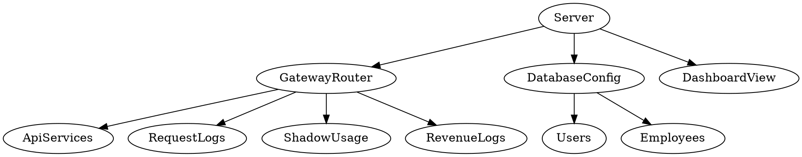
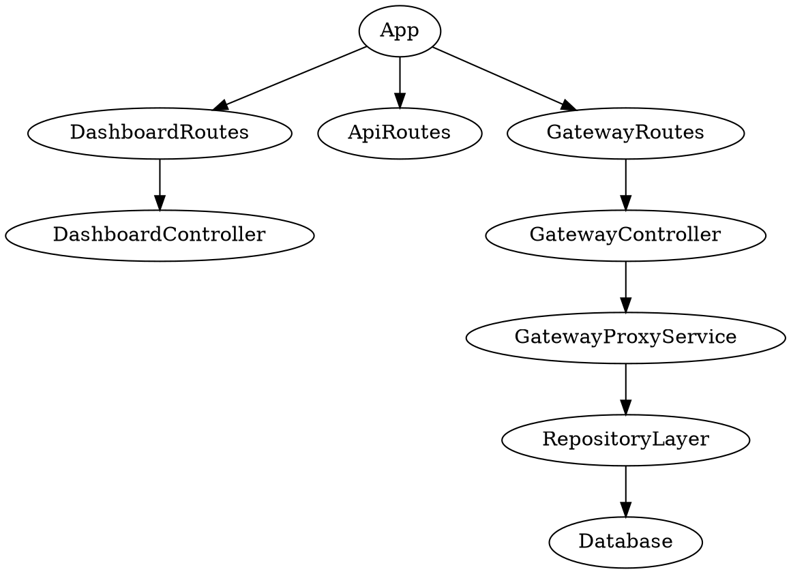

# Laporan Analisis dan Refactoring Kode Aplikasi Web

## 1. Identitas Proyek

| Komponen | Keterangan |
|---|---|
| Nama proyek | RPL Integrator Gateway |
| Nama paket | `rpl-integrator-gateway` |
| Versi | `3.0.0` |
| Deskripsi paket | `API Gateway / Integrator - Middleware Ekosistem UMKM (Tugas Besar RPL Kelompok 7)` |
| Teknologi utama | Node.js, Express 5, EJS, MySQL, JWT, Axios |
| Basis data | MySQL melalui `mysql2/promise` |
| Entry point | `server.js` |
| Fokus laporan | Analisis desain kode dan rancangan refactoring, bukan perubahan kode produksi |

Laporan ini disusun berdasarkan inspeksi repository aktual. Contoh kode sesudah refactoring pada dokumen ini adalah **rancangan refactoring/usulan**, sehingga tidak berarti file produksi sudah diubah.

## 2. Deskripsi Singkat Aplikasi

RPL Integrator adalah aplikasi web berbasis Node.js Express yang berfungsi sebagai API Gateway atau middleware integrasi untuk ekosistem UMKM. Aplikasi menyediakan halaman landing, autentikasi, dashboard admin/operator, client portal, manajemen service tujuan, proxy request ke service terdaftar, pencatatan log request, pencatatan penggunaan service, API key, pembatasan rate limit, audit log, monitoring kesehatan service, dan laporan pendapatan fee gateway.

Berdasarkan `server.js`, endpoint publik utama meliputi `/`, `/login`, `/register`, `/api/status`, dan file statis dari folder `public`. Gateway API dipasang pada `/integrator` dan didefinisikan di `routes/gateway.js`.

## 3. Tujuan Refactoring

Tujuan refactoring yang diusulkan adalah meningkatkan maintainability tanpa mengubah perilaku utama aplikasi. Sasaran teknisnya adalah:

| Tujuan | Penjelasan |
|---|---|
| Memisahkan tanggung jawab | Route, controller, service, repository, validator, dan view dipisahkan agar modul lebih fokus. |
| Mengurangi coupling | Handler HTTP tidak langsung bergantung pada detail SQL dan proses bisnis yang panjang. |
| Meningkatkan cohesion | Modul gateway fokus pada proxy, modul revenue fokus pada fee, modul repository fokus pada akses data. |
| Memudahkan pengujian | Fungsi bisnis dapat diuji tanpa menjalankan Express penuh atau koneksi database nyata. |
| Menjaga perilaku | Refactoring dilakukan bertahap dengan dukungan `npm run check`, `npm test`, dan uji endpoint. |

## 4. Ruang Lingkup Analisis Kode

File utama yang dianalisis:

| File | Peran |
|---|---|
| `server.js` | Bootstrap Express, route halaman, API dashboard, autentikasi, analytics, health check, API key, export CSV. |
| `routes/gateway.js` | Route integrator, dynamic service routing, proxy ke downstream service, idempotency, fee, shadow usage, revenue log. |
| `config/database.js` | Pool MySQL, pembuatan schema, helper migrasi, seed service/user/employee. |
| `middleware/auth.js` | JWT session/API token, role guard, revocation, audit log. |
| `middleware/logger.js` | Insert dan update `request_logs`. |
| `middleware/rateLimitPerUser.js` | Rate limit in-memory/DB dan kuota harian API key. |
| `views/dashboard.ejs` | Tampilan dashboard multi-section dengan JavaScript inline. |
| `views/client_portal.ejs` | Portal user untuk token dan demo integrasi. |
| `public/openapi.json` | Kontrak OpenAPI. |
| `tests/*.test.js` | Pengujian struktur, security config, utility, dan integrasi gateway. |

## 5. Struktur Folder Aplikasi

Struktur folder yang relevan pada repository:

```text
RPL_Integrator-main/
├── ATS/
├── config/
│   ├── database.js
│   └── init.sql
├── Docs/
│   ├── Doc1_Deskripsi_API_Gateway.md
│   ├── Doc2_Fungsional_API_Gateway.md
│   ├── Doc3_Flow_Ekosistem.md
│   ├── Doc4_Aturan_Pengerjaan.md
│   ├── Doc5_Dokumentasi.md
│   ├── Doc6_Aturan_Keuangan.md
│   ├── images/
│   └── assets/
├── middleware/
│   ├── auth.js
│   ├── csrf.js
│   ├── logger.js
│   └── rateLimitPerUser.js
├── public/
│   ├── css/kong-theme.css
│   ├── favicon.svg
│   ├── openapi.json
│   └── Panduan_Integrasi_API_Update.pdf
├── routes/
│   └── gateway.js
├── scripts/
├── tests/
│   ├── app-structure.test.js
│   ├── gateway-utils.test.js
│   ├── integration.test.js
│   └── security-config.test.js
├── utils/
│   ├── gatewayUtils.js
│   └── urlSafety.js
├── views/
│   ├── client_portal.ejs
│   ├── dashboard.ejs
│   ├── index.ejs
│   ├── login.ejs
│   └── register.ejs
├── docker-compose.yml
├── package.json
├── package-lock.json
└── server.js
```

Catatan ukuran file aktual:

| File | Jumlah baris |
|---|---:|
| `server.js` | 2815 |
| `routes/gateway.js` | 630 |
| `config/database.js` | 476 |
| `views/dashboard.ejs` | 1530 |
| `middleware/rateLimitPerUser.js` | 177 |
| `middleware/logger.js` | 64 |

## 6. Ringkasan Arsitektur MVC

Pola aplikasi lebih tepat disebut Express route-controller-view/database flow, karena controller belum dipisah sebagai modul mandiri.

Alur dashboard:

```text
Browser -> Express route di server.js -> pool.query() ke MySQL -> res.render("dashboard") -> views/dashboard.ejs
```

Alur gateway:

```text
Client -> /integrator -> validateApiToken -> rateLimitPerUser -> loggerMiddleware
       -> routes/gateway.js -> api_services/request_logs/revenue_logs/shadow_service_usage
       -> axios ke service tujuan -> response JSON ke client
```

Alur database:

```text
startServer() -> initDatabase() di config/database.js
              -> CREATE TABLE IF NOT EXISTS ...
              -> addColumn/addIndex/addForeignKey helper
              -> seed api_services/users/employees
```

Komponen view sudah menggunakan EJS, tetapi `views/dashboard.ejs` masih menjadi satu file besar yang menangani banyak section dashboard sekaligus.

## 7. Daftar Temuan Masalah Kode

| No | Lokasi | Temuan | Prinsip terkait |
|---:|---|---|---|
| 1 | `server.js` | Terlalu banyak tanggung jawab dalam satu file: bootstrap, auth, dashboard, CRUD, analytics, export, health check, API key. | SRP, Clean Code, High Cohesion |
| 2 | `routes/gateway.js` | Handler gateway mencampur proxy, validasi, scope, idempotency, logging, revenue, fee debit, dan error handling. | SRP, Low Coupling |
| 3 | `config/database.js` | Konfigurasi koneksi, schema creation, helper migrasi, dan seed data berada dalam satu modul. | SRP, High Cohesion |
| 4 | `views/dashboard.ejs` | View dashboard sangat besar dan berisi banyak section serta JavaScript inline. | Clean Code, High Cohesion |
| 5 | `server.js`, `routes/gateway.js`, `middleware/rateLimitPerUser.js` | Handler HTTP dan middleware banyak menulis SQL langsung sehingga logic bisnis terikat ke detail tabel. | DIP, Low Coupling |
| 6 | Beberapa file | Role, status, scope, label service, dan string aksi audit banyak ditulis sebagai literal berulang. | Clean Code, Open/Closed |

## 8. Analisis Before-After Refactoring

### Temuan 1 - `server.js` Memiliki Terlalu Banyak Tanggung Jawab

**Lokasi kode:** `server.js`, terutama route dashboard dan API dari sekitar baris 136 sampai 2760.

**Before refactoring:**

```js
app.get("/dashboard", ...dashboardAuth, async (req, res) => {
  const [
    base,
    [reqCount],
    [successCount],
    [errorCount],
    [revenueSum],
    [services],
    [recentLogs],
    [consumers],
    [chartRows],
    [alerts],
  ] = await Promise.all([
    dashboardBase(req),
    pool.query("SELECT COUNT(*) AS total FROM request_logs"),
    pool.query("SELECT COUNT(*) AS total FROM request_logs WHERE status = 'SUCCESS'"),
    pool.query("SELECT COUNT(*) AS total FROM request_logs WHERE status = 'ERROR'"),
    pool.query("SELECT COALESCE(SUM(nominal_fee), 0) AS total FROM revenue_logs"),
    pool.query("SELECT * FROM api_services ORDER BY nama_service ASC"),
    pool.query("SELECT * FROM request_logs ORDER BY id DESC LIMIT 5"),
    pool.query("SELECT COUNT(DISTINCT user_id) AS total FROM request_logs WHERE user_id IS NOT NULL"),
    pool.query("SELECT DATE_FORMAT(timestamp, '%m/%d') AS label, COUNT(*) AS total FROM request_logs ..."),
    pool.query("SELECT * FROM system_alerts WHERE is_resolved = 0 ORDER BY created_at DESC LIMIT 5"),
  ]);
  res.render("dashboard", { ...base, section: "overview", services, recentLogs, alerts });
});
```

**Masalah:**

Route Express langsung mengurus query, komposisi data dashboard, perhitungan metrik, fallback error, dan rendering. Perubahan kecil pada dashboard dapat memaksa pengembang membaca file `server.js` yang sangat panjang.

**Prinsip terkait:** Single Responsibility Principle, Clean Code, High Cohesion.

**Strategi refactoring:** pindahkan komposisi data dashboard ke `services/dashboardService.js`, akses database ke repository, dan sisakan route/controller sebagai penghubung HTTP.

**After refactoring - rancangan refactoring/usulan:**

```js
// routes/dashboardRoutes.js
router.get("/", dashboardAuth, dashboardController.overview);

// controllers/dashboardController.js
async function overview(req, res) {
  const viewModel = await dashboardService.getOverview(req.sessionUser);
  return res.render("dashboard/overview", viewModel);
}

// services/dashboardService.js
async function getOverview(currentUser) {
  const [base, summary, services, recentLogs, alerts] = await Promise.all([
    dashboardRepository.getBase(currentUser),
    dashboardRepository.getRequestSummary(),
    serviceRepository.findAll(),
    requestLogRepository.findRecent(5),
    alertRepository.findOpen(5),
  ]);
  return { ...base, section: "overview", ...summary, services, recentLogs, alerts };
}
```

**Dampak perbaikan:** route menjadi pendek, query terkumpul di repository, dan logika dashboard dapat diuji tanpa memanggil Express.

### Temuan 2 - `routes/gateway.js` Mencampur Banyak Alur Bisnis

**Lokasi kode:** `routes/gateway.js`, fungsi `proxyToService()` sekitar baris 402 sampai 600.

**Before refactoring:**

```js
async function proxyToService(req, res, serviceName, forwardPath = "") {
  const normalizedServiceName = normalizeServiceName(serviceName);
  const targetService = await getActiveServiceByName(normalizedServiceName);
  const requiredScope = `proxy:${normalizedServiceName}`;
  const targetUrlSafety = await assertSafeHttpUrl(targetService.url_tujuan);
  const { amount: transactionAmount, valid: amountValid } = parseTransactionAmount(req);
  const idempotency = await beginIdempotency(req, normalizedServiceName, forwardPath);
  const gatewayFee = Math.round(transactionAmount * (GATEWAY_FEE_PERCENT / 100));
  const response = await axios({ method: req.method, url: targetUrl, data: req.body });
  if (downstreamSuccess) {
    feeStatus = await tryDebitGatewayFee(req, gatewayFee, transactionAmount);
    if (recordedFee > 0) await recordRevenue(req.logId, recordedFee);
  }
  await updateRequestLog(req.logId, { status: downstreamSuccess ? "SUCCESS" : "ERROR" });
  return res.status(response.status).json(responseBody);
}
```

**Masalah:**

Satu fungsi menjalankan validasi service, scope API key, proteksi SSRF, idempotency, proxy HTTP, kalkulasi fee, debit SmartBank, update log, pencatatan revenue, dan pembuatan response. Ini meningkatkan risiko regression ketika satu bagian diubah.

**Prinsip terkait:** Single Responsibility Principle, Low Coupling.

**Strategi refactoring:** pecah menjadi `GatewayProxyService`, `IdempotencyService`, `RevenueService`, `RequestLogRepository`, dan `ShadowUsageService`.

**After refactoring - rancangan refactoring/usulan:**

```js
// controllers/gatewayController.js
async function proxy(req, res) {
  const result = await gatewayProxyService.forward({
    serviceName: req.params.service,
    forwardPath: req.params.path,
    method: req.method,
    headers: req.headers,
    body: req.body,
    query: req.query,
    user: req.user,
    logId: req.logId,
  });
  return res.status(result.httpStatus).json(result.body);
}

// services/gatewayProxyService.js
async function forward(command) {
  const service = await serviceRepository.findActiveByName(command.serviceName);
  scopeValidator.assertCanProxy(command.user, service.nama_service);
  await urlSafetyValidator.assertSafe(service.url_tujuan);
  const idempotency = await idempotencyService.begin(command);
  const downstream = await downstreamClient.send(service, command);
  const revenue = await revenueService.recordIfEligible(command, downstream);
  await requestLogRepository.markFinished(command.logId, downstream);
  return responseFactory.fromDownstream(downstream, revenue, idempotency);
}
```

**Dampak perbaikan:** gateway lebih mudah diuji per skenario, misalnya idempotency, fee, dan proxy dapat diuji terpisah.

### Temuan 3 - `config/database.js` Menyatukan Koneksi, Schema, Migrasi, dan Seed

**Lokasi kode:** `config/database.js`, fungsi `initDatabase()` sekitar baris 193 sampai 508.

**Before refactoring:**

```js
const pool = mysql.createPool({ host, port, user, password, database });

async function initDatabase() {
  await pool.query(`CREATE TABLE IF NOT EXISTS users (...)`);
  await pool.query(`CREATE TABLE IF NOT EXISTS employees (...)`);
  await pool.query(`CREATE TABLE IF NOT EXISTS api_services (...)`);
  await addColumnIfMissing("api_services", "health_path", "ALTER TABLE ...");
  await seedApiServices();
  if (process.env.NODE_ENV !== "production") {
    await seedUsers();
  }
  await seedEmployees();
}

module.exports = { pool, initDatabase };
```

**Masalah:**

Modul database menjalankan banyak peran: membuat pool, mengelola schema, menjalankan perubahan struktur, dan mengisi data awal. Saat schema bertambah, file ini akan semakin sulit dirawat.

**Prinsip terkait:** Single Responsibility Principle, High Cohesion.

**Strategi refactoring:** pisahkan menjadi `database/pool.js`, `database/schema.js`, `database/migrations/*.js`, dan `database/seeders/*.js`.

**After refactoring - rancangan refactoring/usulan:**

```js
// database/index.js
async function initDatabase() {
  await schemaRunner.createBaseSchema(pool);
  await migrationRunner.runPending(pool);
  await seedRunner.seedDevelopmentData(pool, process.env.NODE_ENV);
}

// database/pool.js
const pool = mysql.createPool(databaseConfig.fromEnv(process.env));
module.exports = { pool };
```

**Dampak perbaikan:** konfigurasi koneksi tidak tercampur dengan definisi tabel, dan perubahan schema dapat ditelusuri sebagai migrasi yang lebih kecil.

### Temuan 4 - `views/dashboard.ejs` Terlalu Besar dan Berisi JavaScript Inline

**Lokasi kode:** `views/dashboard.ejs`, 1530 baris.

**Before refactoring:**

```ejs
<% if (section === 'services') { %>
  <!-- tabel service dan modal -->
<% } else if (section === 'analytics') { %>
  <!-- chart analytics -->
<% } else if (section === 'apikeys') { %>
  <!-- daftar API key -->
<% } %>

<script>
  function editService(el) { ... }
  async function submitService(e) { ... }
  async function generateApiKey() { ... }
  async function resolveAlert(id) { ... }
</script>
```

**Masalah:**

Satu view menangani banyak halaman dashboard sekaligus. JavaScript inline untuk service, user, API key, alert, dan import CSV berada di file yang sama sehingga perubahan UI kecil dapat berdampak pada bagian lain.

**Prinsip terkait:** Clean Code, High Cohesion.

**Strategi refactoring:** pecah view menjadi layout dan partial per section, pindahkan JavaScript dashboard ke file statis per domain.

**After refactoring - rancangan refactoring/usulan:**

```ejs
<!-- views/dashboard/layout.ejs -->
<%- include("../partials/sidebar", { currentUser, section }) %>
<main>
  <%- body %>
</main>
<script src="/js/dashboard/services.js" defer></script>

<!-- views/dashboard/services.ejs -->
<%- include("../partials/service-table", { services }) %>
<%- include("../partials/service-modal") %>
```

**Dampak perbaikan:** section dashboard dapat dikembangkan dan diuji secara lebih terpisah, serta konflik antar script menjadi lebih kecil.

### Temuan 5 - Handler HTTP Terikat Langsung ke SQL

**Lokasi kode:** `server.js` endpoint analytics sekitar baris 772 sampai 930, endpoint services sekitar baris 1428 sampai 1628, `routes/gateway.js` helper `recordRevenue()` dan `recordShadowUsage()`, serta `middleware/rateLimitPerUser.js`.

**Before refactoring:**

```js
const [serviceEffectiveness] = await pool.query(
  `SELECT
      service_name,
      COUNT(*) AS total_usage,
      SUM(CASE WHEN request_status = 'SUCCESS' THEN 1 ELSE 0 END) AS success_count,
      SUM(CASE WHEN request_status = 'ERROR' THEN 1 ELSE 0 END) AS error_count
   FROM shadow_service_usage
   WHERE used_at BETWEEN ? AND ?
   GROUP BY service_name
   ORDER BY total_usage DESC, service_name ASC
   LIMIT 10`,
  range.params,
);
```

**Masalah:**

Perubahan nama kolom, tabel, atau strategi query akan menyentuh route/controller. Ini membuat route sulit dibaca dan menghambat pengujian logic bisnis tanpa database.

**Prinsip terkait:** Dependency Inversion Principle, Low Coupling.

**Strategi refactoring:** pindahkan SQL ke repository dan expose method sesuai kebutuhan bisnis.

**After refactoring - rancangan refactoring/usulan:**

```js
// repositories/shadowUsageRepository.js
async function getServiceEffectiveness(range) {
  return pool.query(SQL_SERVICE_EFFECTIVENESS, [range.start, range.end]);
}

// services/analyticsService.js
async function getAnalytics(range) {
  return {
    serviceEffectiveness: await shadowUsageRepository.getServiceEffectiveness(range),
    sourceAppUsage: await shadowUsageRepository.getSourceAppUsage(range),
  };
}
```

**Dampak perbaikan:** detail SQL terkonsentrasi di repository, sementara service/controller menggunakan bahasa bisnis.

### Temuan 6 - Magic String untuk Role, Status, Scope, dan Action

**Lokasi kode:** `server.js`, `routes/gateway.js`, `middleware/rateLimitPerUser.js`, `middleware/auth.js`.

**Before refactoring:**

```js
const requiredScope = `proxy:${normalizedServiceName}`;
status: downstreamSuccess ? "SUCCESS" : "ERROR";
return res.redirect(user.role === "user" ? "/client-portal" : "/dashboard");
await logAudit(req.sessionUser.id, req.sessionUser.username, "CREATE_SERVICE", "api_services", ...);
```

**Masalah:**

String literal berulang rentan salah ketik dan sulit dicari sebagai satu konsep domain. Misalnya status `SUCCESS`, `ERROR`, `FORWARDED`, role `admin`, `operator`, `user`, dan action audit ditulis langsung di beberapa titik.

**Prinsip terkait:** Clean Code, Open/Closed Principle.

**Strategi refactoring:** buat `constants/domain.js` atau modul konstanta per domain.

**After refactoring - rancangan refactoring/usulan:**

```js
// constants/domain.js
const Roles = Object.freeze({ ADMIN: "admin", OPERATOR: "operator", USER: "user" });
const RequestStatus = Object.freeze({ PENDING: "PENDING", FORWARDED: "FORWARDED", SUCCESS: "SUCCESS", ERROR: "ERROR" });
const AuditAction = Object.freeze({ CREATE_SERVICE: "CREATE_SERVICE", UPDATE_SERVICE: "UPDATE_SERVICE" });

module.exports = { Roles, RequestStatus, AuditAction };
```

**Dampak perbaikan:** nilai domain lebih konsisten, refactoring lebih aman, dan pengembangan fitur baru dapat memakai konstanta yang sama.

## 9. Class Diagram Sebelum Refactoring

File DOT:

```text
Docs/assets/class_diagram_sebelum_refactoring.dot
```

Ringkasan diagram sebelum refactoring:



Diagram ini menggambarkan kondisi saat ini: `server.js` dan `routes/gateway.js` memiliki ketergantungan langsung ke pool/database dan beberapa tabel operasional.

## 10. Class Diagram Sesudah Refactoring

File DOT:

```text
Docs/assets/class_diagram_sesudah_refactoring.dot
```

Ringkasan diagram sesudah refactoring:



Diagram ini adalah **rancangan refactoring/usulan**. Tujuannya adalah memisahkan route/controller, service, repository, validator/helper, view, dan database table.

## 11. Analisis SOLID

| Prinsip | Kondisi saat ini | Usulan refactoring |
|---|---|---|
| SRP | `server.js`, `routes/gateway.js`, dan `config/database.js` memiliki banyak alasan untuk berubah. | Pisahkan controller, service, repository, schema, migration, dan seeder. |
| OCP | Perubahan status, scope, atau aksi audit masih sering menyentuh literal di banyak file. | Pusatkan konstanta domain dan tambahkan strategy/service baru tanpa mengubah handler utama. |
| LSP | Tidak banyak inheritance/subclass dalam repository ini, sehingga prinsip ini tidak dominan. | Jika nanti ada client downstream berbeda, gunakan interface kontrak yang konsisten. |
| ISP | Handler besar memerlukan terlalu banyak detail dependency sekaligus. | Controller hanya bergantung pada service yang relevan. |
| DIP | Route bergantung langsung pada `pool.query()` dan detail tabel. | Route/controller bergantung pada service; service bergantung pada repository interface. |

## 12. Analisis Clean Code

| Aspek | Observasi | Usulan |
|---|---|---|
| Ukuran file | `server.js` 2815 baris dan `dashboard.ejs` 1530 baris. | Pecah berdasarkan fitur dan section. |
| Nama fungsi | Beberapa nama sudah jelas, seperti `normalizeServiceName`, `getDateRange`, `recordRevenue`. | Pertahankan nama berbasis domain dan pindahkan ke modul yang tepat. |
| Duplikasi konsep | Status, role, dan action audit ditulis sebagai string literal. | Gunakan konstanta domain. |
| Komentar | Ada komentar informatif pada beberapa middleware. | Hindari komentar yang menggantikan struktur; gunakan modul kecil agar kode menjelaskan dirinya sendiri. |
| Testability | Test sudah ada dan cukup baik untuk gateway/security, tetapi handler dashboard sulit diuji unit. | Tambahkan test service/repository dengan mock pool. |

## 13. High Cohesion dan Low Coupling

Kondisi saat ini menunjukkan cohesion yang belum optimal pada beberapa file besar:

| Area | Kondisi saat ini | Arah perbaikan |
|---|---|---|
| `server.js` | Banyak fitur dashboard dan API berada pada satu file. | Kelompokkan per controller dan route module. |
| `routes/gateway.js` | Gateway proxy, revenue, shadow usage, idempotency, dan log berada dalam satu file. | Pisahkan service bisnis sesuai domain. |
| `config/database.js` | Koneksi, schema, migrasi, dan seed menyatu. | Pisahkan pool, schema runner, migration, dan seeder. |
| `views/dashboard.ejs` | Banyak section view dan script inline menyatu. | Gunakan partial EJS dan static JS per fitur. |

Low coupling dapat dicapai dengan repository layer. Dengan begitu, controller tidak perlu mengetahui struktur tabel `request_logs`, `shadow_service_usage`, `api_keys`, atau `revenue_logs` secara langsung.

## 14. Bukti Aplikasi Tetap Berjalan

### `npm run check`

Perintah:

```bash
npm run check
```

Hasil ringkas:

```text
node --check server.js
node --check routes/gateway.js
node --check middleware/auth.js
node --check middleware/rateLimitPerUser.js
node --check middleware/csrf.js
node --check utils/urlSafety.js
node --check tests/app-structure.test.js
node --check tests/integration.test.js
Exit code: 0
```

Artinya semua file yang dicek oleh script `check` lolos validasi sintaks Node.js.

### `npm test`

Perintah:

```bash
npm test
```

Hasil aktual:

```text
tests 22
pass 22
fail 0
cancelled 0
skipped 0
todo 0
duration_ms 2901.9223
```

Dengan demikian, `npm test` menghasilkan 22 pass, 0 fail.

### Endpoint `/api/status`

Kondisi lingkungan lokal:

```text
Test-NetConnection 127.0.0.1:3306 -> TcpTestSucceeded: False
Test-NetConnection 127.0.0.1:3307 -> TcpTestSucceeded: False
```

Karena MySQL lokal tidak aktif, uji endpoint dilakukan pada Express app dengan mock `pool.query()` untuk membuktikan wiring route `/api/status`.

Perintah uji ringkas:

```bash
node -e "require app, mock pool.query, app.listen(0), fetch('/api/status')"
```

Hasil aktual:

```text
HTTP 200
{"status":"online","application":"API Gateway / Integrator","kelompok":7,"version":"3.0.0","uptime":"0s","total_requests":12,"registered_services":2,"active_services":1,"fee_gateway":"0.5%","timestamp":"2026-06-22T03:39:04.507Z"}
```

Catatan: ini adalah uji endpoint dengan mock database, bukan uji end-to-end ke MySQL nyata.

### Catatan Manual Dashboard/Login/Analytics

Manual check UI penuh belum dilakukan pada sesi ini karena database MySQL lokal tidak berjalan. Repository memiliki aset dokumentasi visual di `Docs/images/`, termasuk `api_status.png`, `dashboard.png`, `dashboard_new.png`, `client_portal.png`, dan `client_portal_new.png`, tetapi laporan ini tidak mengklaim screenshot tersebut sebagai hasil uji manual baru.

Checklist manual yang masih disarankan:

| Halaman/Fitur | Status pada laporan ini |
|---|---|
| Login demo admin/operator/user | Belum diuji manual ulang pada sesi ini |
| Dashboard overview | Belum diuji manual ulang pada sesi ini |
| Analytics | Belum diuji manual ulang pada sesi ini |
| Data karyawan/employees | Belum diuji manual ulang pada sesi ini |
| Shadow service usage table | Belum diuji manual ulang pada sesi ini |
| API key page | Belum diuji manual ulang pada sesi ini |

## 15. Kesimpulan

RPL Integrator sudah memiliki fitur gateway yang cukup lengkap: autentikasi, API key, dynamic service routing, logging, rate limit, idempotency, revenue log, dashboard monitoring, dan dokumentasi OpenAPI. Pengujian otomatis juga menunjukkan kondisi baik dengan 22 test lulus.

Masalah utama bukan pada fungsi dasar aplikasi, melainkan pada struktur kode yang mulai membesar. File `server.js`, `routes/gateway.js`, `config/database.js`, dan `views/dashboard.ejs` menanggung banyak tanggung jawab. Refactoring yang disarankan adalah pemisahan bertahap ke route/controller, service, repository, validator/helper, partial view, serta konstanta domain. Pendekatan ini menjaga perilaku aplikasi sambil meningkatkan maintainability, testability, high cohesion, dan low coupling.

## 16. Lampiran

### Lampiran A - File Diagram

| File | Keterangan |
|---|---|
| `Docs/assets/class_diagram_sebelum_refactoring.dot` | DOT diagram kondisi saat ini. |
| `Docs/assets/class_diagram_sesudah_refactoring.dot` | DOT diagram rancangan refactoring. |
| `Docs/assets/class_diagram_sebelum_refactoring.svg` | Render SVG fallback dari diagram sebelum refactoring. |
| `Docs/assets/class_diagram_sesudah_refactoring.svg` | Render SVG fallback dari diagram sesudah refactoring. |

### Lampiran B - Status Render Graphviz

Perintah `dot -V` dijalankan dan menghasilkan error bahwa `dot` tidak dikenali sebagai command. Artinya Graphviz CLI belum tersedia di environment lokal ini. File DOT tetap dibuat sesuai requirement, dan SVG fallback dibuat agar diagram tetap dapat dilihat.

### Lampiran C - File Repository yang Menjadi Dasar Analisis

| File | Bukti yang digunakan |
|---|---|
| `package.json` | Nama aplikasi, versi, script `check` dan `test`, dependency utama. |
| `server.js` | Route dashboard, auth, API service/user/API key, analytics, health check, `/api/status`. |
| `routes/gateway.js` | Proxy gateway, dynamic service routing, idempotency, revenue, shadow usage. |
| `config/database.js` | Pool MySQL, schema, migration helper, seed data. |
| `views/dashboard.ejs` | View dashboard multi-section dan JavaScript inline. |
| `tests/app-structure.test.js` | Bukti fitur yang dijaga oleh test struktur aplikasi. |
| `tests/integration.test.js` | Bukti pengujian integrasi gateway, auth, quota, scope, proxy, idempotency. |
